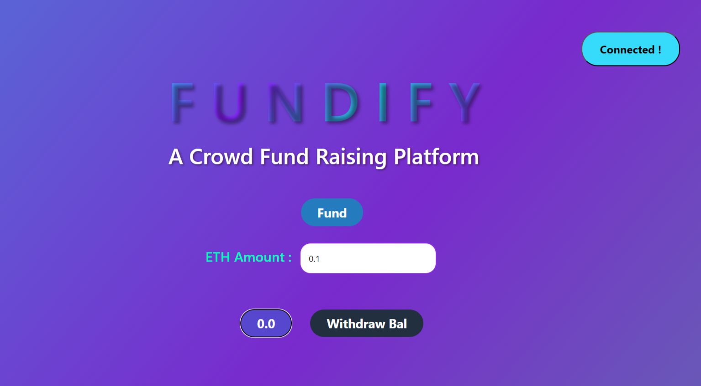
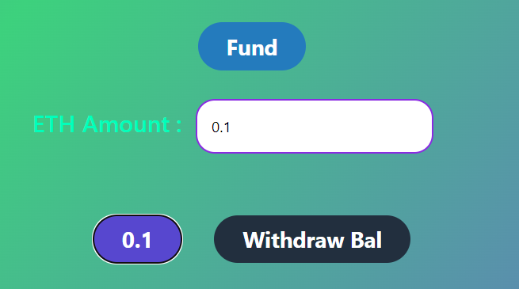
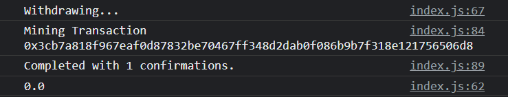
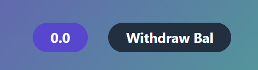

<h1>
Fundify 💰
</h1>

<h2>
A crowd funding decentralized application
</h2>

<h3>
Home Page
</h3>

<h3>
Funding the contract with 0.1 Sepolia ETH
</h3>

<h3>
Withdrawing the tokens from the contract
</h3>

<h4>Get Balance after withdrawal displays 0.0. Hence the withdrawal is successful and the owner gets the funds.</h4>

